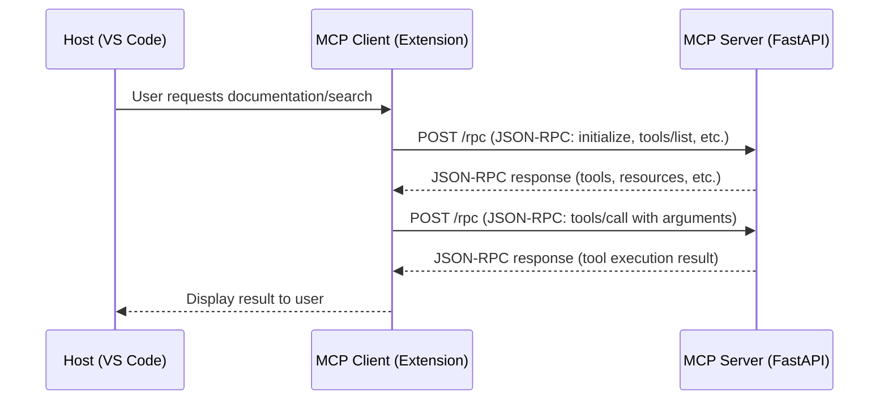

# Model Context Protocol (MCP): A Comprehensive Guide

## Table of Contents
- [Introduction](#introduction)
- [What is MCP?](#what-is-mcp)
- [Core Architecture](#core-architecture)
- [Key Components](#key-components)
- [Protocol Specification](#protocol-specification)
- [Implementation Patterns](#implementation-patterns)
- [Building MCP Servers](#building-mcp-servers)
- [Client Integration](#client-integration)
- [Security Considerations](#security-considerations)
- [Best Practices](#best-practices)
- [Use Cases and Applications](#use-cases-and-applications)
- [Troubleshooting](#troubleshooting)
- [Future Developments](#future-developments)

## Introduction

The Model Context Protocol (MCP) represents a significant advancement in how AI models interact with external systems and data sources. As AI applications become more sophisticated, there's an increasing need for standardized ways to extend model capabilities beyond their training data, enabling real-time access to databases, APIs, file systems, and other dynamic resources.

This article provides a comprehensive overview of MCP, its architecture, implementation strategies, and practical applications. Whether you're building AI-powered applications or integrating external data sources with language models, understanding MCP is crucial for modern AI development.

## What is MCP?

Model Context Protocol (MCP) is an open standard that defines how AI models can securely and efficiently access external resources and services. It provides a standardized interface between AI models (clients) and external systems (servers), enabling models to retrieve real-time information, execute functions, and interact with various data sources while maintaining security and performance.

### Key Objectives

MCP was designed with several core objectives:

- **Standardization**: Provide a uniform way for AI models to interact with external systems
- **Security**: Ensure secure communication and controlled access to sensitive resources
- **Extensibility**: Support a wide range of data sources and services through a flexible architecture
- **Performance**: Enable efficient data retrieval and processing with minimal latency
- **Interoperability**: Allow different AI models and systems to work with the same MCP servers

### Why MCP Matters

Traditional AI models are limited by their training data cutoff and cannot access real-time information or interact with dynamic systems. MCP addresses these limitations by:

1. **Real-time Data Access**: Models can fetch current information from databases, APIs, and live data sources
2. **Function Execution**: Models can trigger actions and execute functions in external systems
3. **Resource Management**: Provides controlled access to file systems, network resources, and system operations
4. **Context Enhancement**: Enriches model responses with up-to-date, relevant information

## Core Architecture

MCP follows a client-server architecture where AI models (or applications using AI models) act as clients, and external systems expose their capabilities through MCP servers.

### Architecture Components

```
┌─────────────────┐    MCP Protocol    ┌─────────────────┐
│   MCP Client    │◄──────────────────►│   MCP Server    │
│  (AI Model/App) │                    │ (External Sys.) │
└─────────────────┘                    └─────────────────┘
        │                                       │
        │                                       │
        ▼                                       ▼
┌─────────────────┐                    ┌─────────────────┐
│ Model Interface │                    │ Resource Access │
│   • Requests    │                    │   • Database    │
│   • Processing  │                    │   • File System │
│   • Responses   │                    │   • APIs        │
└─────────────────┘                    └─────────────────┘
```

### Sequence Diagram



### Communication Flow

1. **Discovery**: Client discovers available MCP servers and their capabilities
2. **Authentication**: Secure authentication and authorization process
3. **Request**: Client sends structured requests for data or function execution
4. **Processing**: Server processes requests and accesses required resources
5. **Response**: Server returns structured responses with requested data or results
6. **Context Integration**: Client integrates responses into model context

## Key Components

### MCP Server

An MCP server is a service that exposes external resources and capabilities to AI models through the MCP protocol. Servers can provide:

- **Data Resources**: Access to databases, file systems, APIs, and other data sources
- **Function Capabilities**: Executable functions for performing actions or computations
- **Tool Integrations**: Connections to external tools and services
- **Resource Management**: Controlled access to system resources

### MCP Client  

An MCP client is typically an AI model or an application that uses AI models. Clients:

- Discover and connect to MCP servers
- Send requests for data or function execution
- Process responses and integrate them into model context
- Handle authentication and error management

### Protocol Messages

MCP defines several types of messages for different interactions:

#### Resource Messages
- `resources/list`: List available resources
- `resources/read`: Read resource content
- `resources/subscribe`: Subscribe to resource changes

#### Tool Messages
- `tools/list`: List available tools/functions
- `tools/call`: Execute a specific tool/function

#### Prompt Messages
- `prompts/list`: List available prompt templates
- `prompts/get`: Retrieve specific prompt templates

## Protocol Specification

### Message Structure

MCP messages follow a JSON-RPC 2.0-inspired structure:

```json
{
  "jsonrpc": "2.0",
  "id": "unique-request-id",
  "method": "resources/read",
  "params": {
    "uri": "file:///path/to/resource",
    "mimeType": "text/plain"
  }
}
```

### Response Format

```json
{
  "jsonrpc": "2.0",
  "id": "unique-request-id",
  "result": {
    "contents": [
      {
        "uri": "file:///path/to/resource",
        "mimeType": "text/plain",
        "text": "Resource content here"
      }
    ]
  }
}
```

### Error Handling

```json
{
  "jsonrpc": "2.0",
  "id": "unique-request-id",
  "error": {
    "code": -32602,
    "message": "Invalid params",
    "data": {
      "details": "Resource not found"
    }
  }
}
```

## Implementation Patterns

### Server-Side Implementation

When implementing an MCP server, consider these patterns:

#### 1. Resource-Centric Pattern
Organize your server around the types of resources you're exposing:

```python
class DatabaseResourceHandler:
    async def list_resources(self):
        # Return available database tables/views
        pass
    
    async def read_resource(self, uri):
        # Execute query and return results
        pass

class FileSystemResourceHandler:
    async def list_resources(self):
        # Return available files/directories
        pass
    
    async def read_resource(self, uri):
        # Read and return file content
        pass
```

#### 2. Tool-Centric Pattern
Focus on the functions and capabilities you're providing:

```python
class CalculationTools:
    async def calculate_statistics(self, data):
        # Perform statistical calculations
        pass
    
    async def generate_report(self, template, data):
        # Generate formatted reports
        pass

class DataProcessingTools:
    async def transform_data(self, data, transformations):
        # Apply data transformations
        pass
    
    async def validate_data(self, data, schema):
        # Validate data against schema
        pass
```

#### 3. Hybrid Pattern
Combine resources and tools for comprehensive functionality:

```python
class ComprehensiveMCPServer:
    def __init__(self):
        self.resource_handlers = {}
        self.tool_handlers = {}
    
    async def handle_request(self, request):
        if request.method.startswith('resources/'):
            return await self.handle_resource_request(request)
        elif request.method.startswith('tools/'):
            return await self.handle_tool_request(request)
```

### Client-Side Integration

#### Model Context Enhancement
```python
class MCPEnhancedModel:
    def __init__(self, model, mcp_clients):
        self.model = model
        self.mcp_clients = mcp_clients
    
    async def generate_response(self, prompt):
        # Analyze prompt for resource needs
        resources = await self.identify_required_resources(prompt)
        
        # Fetch resources from MCP servers
        context_data = await self.fetch_resources(resources)
        
        # Enhance prompt with context
        enhanced_prompt = self.enhance_prompt(prompt, context_data)
        
        # Generate response with enhanced context
        return await self.model.generate(enhanced_prompt)
```

## Building MCP Servers

### Planning Your MCP Server

Before implementing, consider:

1. **Resource Identification**: What data or capabilities will you expose?
2. **Access Patterns**: How will clients typically interact with your resources?
3. **Security Requirements**: What authentication and authorization do you need?
4. **Performance Needs**: What are your latency and throughput requirements?
5. **Scalability**: How will your server handle multiple concurrent clients?

### Development Workflow

1. **Define Resources and Tools**: Clearly specify what your server will provide
2. **Design URI Scheme**: Create a logical URI structure for your resources
3. **Implement Handlers**: Build request handlers for each supported operation
4. **Add Authentication**: Implement security measures appropriate for your use case
5. **Testing**: Thoroughly test with various clients and scenarios
6. **Documentation**: Provide clear documentation for your server's capabilities

### FastAPI Implementation Example

Here's a basic structure for an MCP server using FastAPI:

```python
from fastapi import FastAPI, HTTPException
from pydantic import BaseModel
import asyncio

app = FastAPI(title="MCP Server", version="1.0.0")

class MCPRequest(BaseModel):
    jsonrpc: str = "2.0"
    id: str
    method: str
    params: dict = {}

class MCPResponse(BaseModel):
    jsonrpc: str = "2.0"
    id: str
    result: dict = None
    error: dict = None

@app.post("/mcp")
async def handle_mcp_request(request: MCPRequest):
    try:
        if request.method == "resources/list":
            return MCPResponse(
                id=request.id,
                result={"resources": await list_resources()}
            )
        elif request.method == "resources/read":
            return MCPResponse(
                id=request.id,
                result=await read_resource(request.params)
            )
        # Add more method handlers...
        
    except Exception as e:
        return MCPResponse(
            id=request.id,
            error={"code": -32000, "message": str(e)}
        )

async def list_resources():
    # Implementation for listing resources
    pass

async def read_resource(params):
    # Implementation for reading resources
    pass
```

## Client Integration

### Connecting to MCP Servers

```python
import aiohttp
import json

class MCPClient:
    def __init__(self, server_url, auth_token=None):
        self.server_url = server_url
        self.auth_token = auth_token
        self.session = None
    
    async def connect(self):
        self.session = aiohttp.ClientSession()
        if self.auth_token:
            self.session.headers.update({
                'Authorization': f'Bearer {self.auth_token}'
            })
    
    async def call(self, method, params=None):
        request_data = {
            "jsonrpc": "2.0",
            "id": str(uuid.uuid4()),
            "method": method,
            "params": params or {}
        }
        
        async with self.session.post(
            f"{self.server_url}/mcp",
            json=request_data
        ) as response:
            result = await response.json()
            
            if "error" in result:
                raise Exception(f"MCP Error: {result['error']}")
            
            return result.get("result", {})
```

### Resource Discovery

```python
async def discover_server_capabilities(client):
    # List available resources
    resources = await client.call("resources/list")
    
    # List available tools
    tools = await client.call("tools/list")
    
    # List available prompts
    prompts = await client.call("prompts/list")
    
    return {
        "resources": resources,
        "tools": tools,
        "prompts": prompts
    }
```

## Security Considerations

### Authentication and Authorization

MCP servers should implement appropriate security measures:

1. **API Key Authentication**: Simple but effective for many use cases
2. **OAuth 2.0**: For more complex authorization scenarios
3. **JWT Tokens**: For stateless authentication with embedded claims
4. **mTLS**: For high-security environments requiring mutual authentication

### Access Control

```python
class SecurityManager:
    def __init__(self):
        self.permissions = {}
    
    def check_resource_access(self, client_id, resource_uri):
        client_perms = self.permissions.get(client_id, [])
        return any(
            self.uri_matches_pattern(resource_uri, pattern)
            for pattern in client_perms
        )
    
    def check_tool_access(self, client_id, tool_name):
        client_perms = self.permissions.get(client_id, [])
        return f"tools:{tool_name}" in client_perms
```

### Data Protection

- **Encryption in Transit**: Always use HTTPS/TLS for communication
- **Sensitive Data Handling**: Implement appropriate data masking and filtering
- **Audit Logging**: Log all access attempts and operations for security monitoring
- **Rate Limiting**: Prevent abuse through request rate limiting

## Best Practices

### Server Development

1. **Consistent URI Schemes**: Use logical, hierarchical URI structures
2. **Efficient Resource Loading**: Implement caching and lazy loading where appropriate
3. **Error Handling**: Provide clear, actionable error messages
4. **Documentation**: Maintain comprehensive API documentation
5. **Monitoring**: Implement health checks and performance monitoring

### Client Development

1. **Connection Management**: Implement connection pooling and retry logic
2. **Caching**: Cache frequently accessed resources locally
3. **Timeout Handling**: Set appropriate timeouts for different operations
4. **Graceful Degradation**: Handle server unavailability gracefully

### Performance Optimization

1. **Batch Requests**: Group multiple operations when possible
2. **Streaming**: Use streaming for large data sets
3. **Compression**: Implement response compression for large payloads
4. **Async Operations**: Use async/await patterns for I/O operations

## Use Cases and Applications

### Real-Time Data Integration

MCP servers can provide AI models with access to:
- Live database queries
- Real-time API data
- Streaming data sources
- Current system status

### Dynamic Function Execution

Enable AI models to:
- Trigger automated workflows
- Execute calculations and data processing
- Interact with external services
- Perform system operations

### Knowledge Base Enhancement

Extend AI capabilities with:
- Document retrieval systems
- Search engines
- Knowledge graphs
- Specialized databases

### Multi-Modal Resource Access

Support various content types:
- Text documents and files
- Images and media files
- Structured data (JSON, XML, CSV)
- Binary data and archives

## Troubleshooting

### Common Issues

1. **Connection Timeouts**
   - Check network connectivity
   - Verify server availability
   - Adjust timeout settings

2. **Authentication Failures**
   - Verify credentials
   - Check token expiration
   - Validate permissions

3. **Resource Not Found**
   - Verify URI format
   - Check resource existence
   - Validate access permissions

4. **Performance Issues**
   - Monitor server resources
   - Check database query performance
   - Optimize data transfer

### Debugging Tools

1. **Logging**: Implement comprehensive logging on both client and server
2. **Monitoring**: Use APM tools to track performance and errors
3. **Testing**: Create comprehensive test suites for various scenarios
4. **Documentation**: Maintain up-to-date troubleshooting guides

## Future Developments

The MCP ecosystem continues to evolve with several exciting developments:

### Enhanced Protocol Features
- Improved streaming capabilities
- Better error recovery mechanisms
- Enhanced security features
- Performance optimizations

### Ecosystem Growth
- More server implementations
- Better client libraries
- Integration with popular AI frameworks
- Standardized server discovery mechanisms

### Advanced Capabilities
- Multi-server orchestration
- Federated resource access
- Advanced caching strategies
- Real-time collaboration features

## Conclusion

The Model Context Protocol represents a crucial advancement in AI system architecture, enabling more dynamic, capable, and useful AI applications. By providing standardized access to external resources and capabilities, MCP bridges the gap between static AI models and the dynamic, ever-changing world of real-time data and services.

Whether you're building sophisticated AI applications, integrating legacy systems with modern AI capabilities, or creating new AI-powered services, understanding and implementing MCP will be essential for success in the evolving AI landscape.

The combination of MCP's flexibility, security features, and growing ecosystem makes it an excellent choice for developers looking to extend AI capabilities beyond traditional boundaries. As the protocol continues to mature and gain adoption, we can expect to see even more innovative applications and use cases emerge.

For developers implementing MCP servers with Python and FastAPI, the patterns and practices outlined in this guide provide a solid foundation for building robust, scalable, and secure MCP implementations that can power the next generation of AI applications.

---

*This article serves as a comprehensive guide to MCP implementation and best practices. For the latest protocol specifications and updates, refer to the official MCP documentation and community resources.*